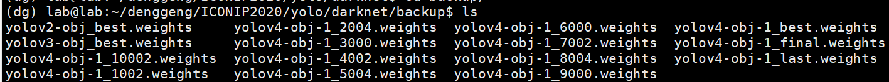
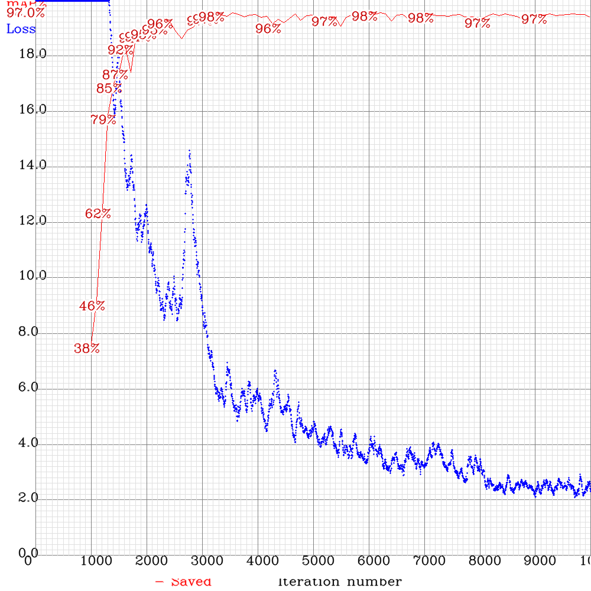
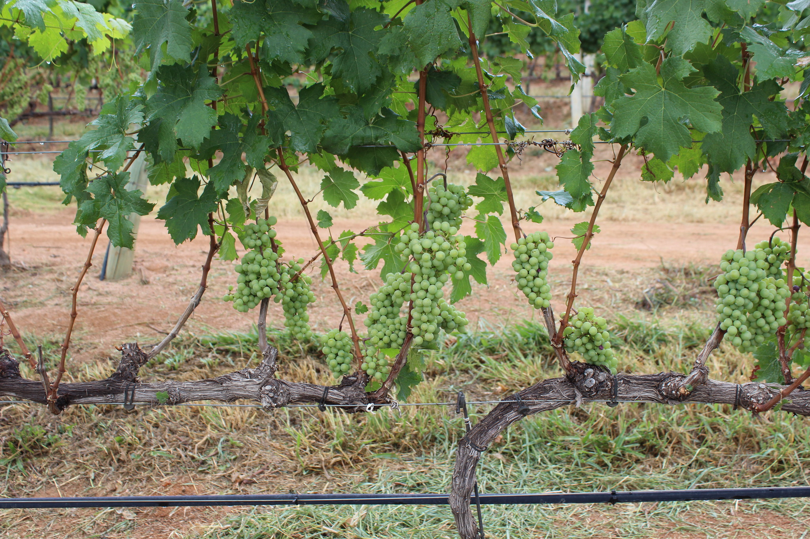
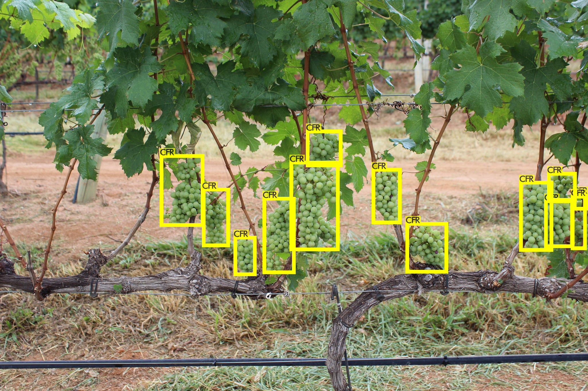
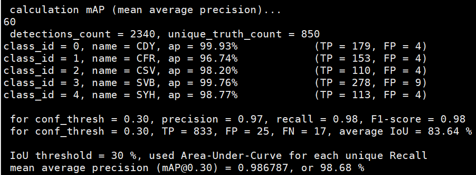
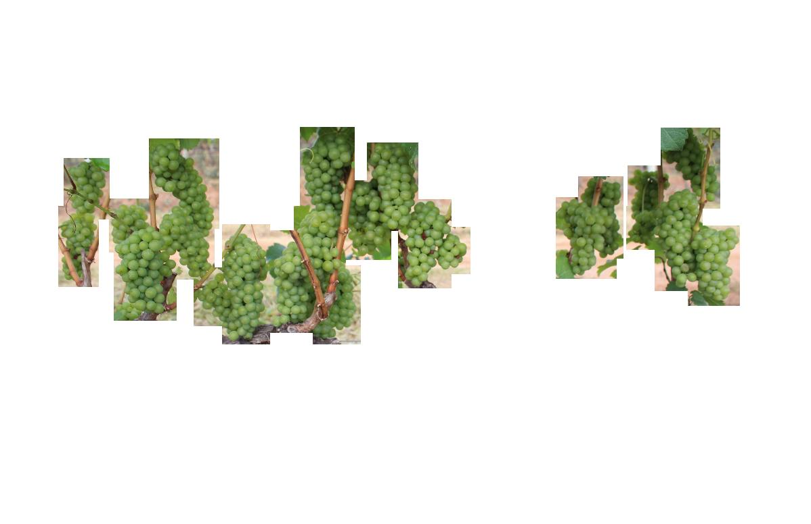
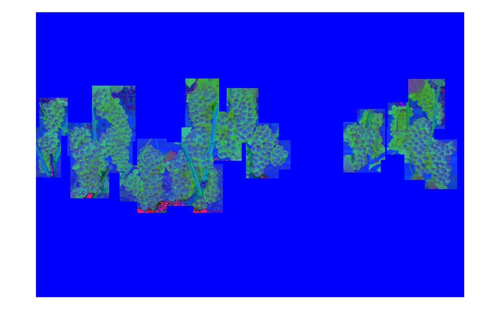
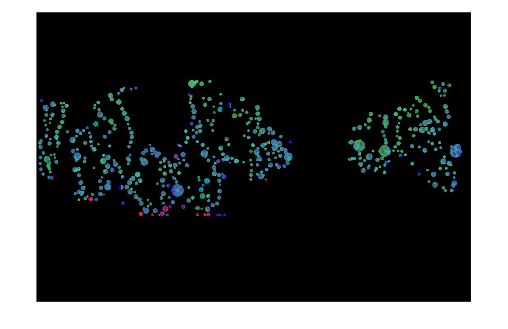

# TSGYE: Two-stage Grape Yield Estimation
Utilize YOLOv4 for grape cluster detection on WGISD dataset, and annotate 58 images of WGISD test set on Huawei ModelArts platform for evaluating grape counting methods.

### Dataset
WGISD (Wine Grape Instance Segmentation Dataset): https://github.com/thsant/wgisd.

we punctuate the grape berries in each image, and then write all coordinate information into xml files.


GrapeCounting
- raw_images # 58 images from WGISD test set
- detect_images # cluster detecting results based on YOLOv4
- count_label # folder for counting label

### YOLOv4
Darknet: https://github.com/AlexeyAB/darknet.

### YOLOv4 grape cluster detection
YOLOv4
- obj.data # the dataset config file for YOLOv4 training and evaluating
- yolov4-obj-1.cfg # the config file of YOLOv4 training network
- yolov4-obj-1_best.weights # load this network weights, you can detect cluster boxes on WGISD dataset accurately
(download link ：https://pan.baidu.com/s/14zRQHkQJbEZU3PVXWi85Uw 
提取码：nx9z)

After you follow the Darknet guideline to deploy YOLO network. you can predict grape clusters by following code.

### Predict clusters
```
./darknet detector test cfg/obj.data cfg/yolov4-obj-1.cfg weights/yolov4/yolov4-obj-1_best.weights
```


## grape cluster detection

### 1如何用YOLOv4训练VOC数据集

#### 1.1准备YOLO编译环境
下载YOLO源码:
```
git clone https://github.com/AlexeyAB/darknet
```
进入darknet目录
```
cd darknet
```
修改编译配置文件MakeFile
```
GPU=1
CUDNN=1
CUDNN_HALF=1
OPENCV=1
AVX=0
OPENMP=0
LIBSO=1
ZED_CAMERA=0 # ZED SDK 3.0 and above
ZED_CAMERA_v2_8=0 # ZED SDK 2.X

# set GPU=1 and CUDNN=1 to speedup on GPU
# set CUDNN_HALF=1 to further speedup 3 x times (Mixed-precision on Tensor Cores) GPU: Volta, Xavier, Turing and higher
# set AVX=1 and OPENMP=1 to speedup on CPU (if error occurs then set AVX=0)

USE_CPP=0
DEBUG=1
```
编译运行配置文件
```
make
```
看到目录下生成的darknet文件，说明上述步骤成功

#### 1.2 VOC数据格式的组装
data/2007_train.txt

data/2007_val.txt

```
VOCdevkit  
│
└───VOC2007
    │
    └───Annotations # 所有图片的xml标签数据
    │   │   CDY_2015.xml
    │   │   ...
    │   
    └───ImageSets   # 数据集的划分
    │   │
    │   └───Main # 所有图片的xml标签数据
    │       │   test.txt  # 测试集图片文件名集合
    │       │   train.txt # 训练集图片文件名集合
    │       │   val.txt   # 验证集图片文件名集合
    │
    └───JPEGImages  # 所有图片的jpg数据
    │   │   CDY_2015.jpg
    │   │   ...
    │
    └───labels      # 所有图片的yolo标签
        │   CDY_2015.txt
        │   ...

```

VOCdevkit
    - VOC2007
        - Annotations # 所有图片的xml标签数据
            - CDY_2015.xml
        - ImageSets   # 数据集的划分
            - Main
                - test.txt  # 测试集图片文件名集合
                - train.txt # 训练集图片文件名集合
                - val.txt   # 验证集图片文件名集合
        - JPEGImages  # 所有图片的jpg数据
            - CDY_2015.jpg
        - labels      # 所有图片的yolo标签
            - CDY_2015.txt

#### 1.3 准备obj.names
```
CDY # 0
CFR # 1
CSV # 2
SVB # 3
SYH # 4
```
放入cfg/路径下

#### 1.4 准备obj.data
```
classes= 5 # 数据集中的类别数
train  = data/2007_train.txt # 训练数据图片文件名汇总
valid  = data/2007_val.txt  # 验证数据图片文件名汇总
names = cfg/obj.names   # class中每一个编号对应的类别名称，需一一对应
backup = backup/ # 权重结果保存路径
```
放入cfg/路径下

#### 1.5 配置YOLOv4网络结构和训练配置文件
```
cp cfg/yolov4-custom.cfg cfg/yolov4-obj.cfg
vim cfg/yolov4-obj.cfg
```
修改yolov4-obj.cfg的内容

Training部分
```
batch=64
subdivisions=64
width=416
height=416
channels=3
momentum=0.949
decay=0.0005
angle=0
saturation = 1.5
exposure = 1.5
hue=.1

learning_rate=0.001
burn_in=1000
max_batches = 10000 # 迭代训练10000次
policy=steps
steps=8000,9000
scales=.1,.1

#cutmix=1
mosaic=1
```

修改class和对应的convolutional层layer数
```
/classes # 关键字搜索找到classes对应的地方
```

对上面的convolutional层修改layer数
```
[convolutional]
size=1
stride=1
pad=1
filters=30  # (classes + 5) * 3, 这里classes是5, 所以filter为30
activation=linear


[yolo]
mask = 0,1,2
anchors = 12, 16, 19, 36, 40, 28, 36, 75, 76, 55, 72, 146, 142, 110, 192, 243, 459, 401
classes=5
num=9
```
需要上述这样操作的地方还有3处，因为有3个yolo层。

下载yolov4.conv.137预训练配置文件
下载链接:https://drive.google.com/open?id=1JKF-bdIklxOOVy-2Cr5qdvjgGpmGfcbp

以上，yolov4训练自己数据集的准备工作已经做好了,需要以下几个部分
- VOC格式的数据    # 划分好训练集和测试集
- obj.names       # 数据集中类别的名称
- obj.data        # 数据集相关配置信息
- yolov4-obj.cfg  # 网络配置和训练文件
- yolov4.conv.137 # 加载的预训练权重

### 2 如何利用earlystopping选取表现最好的权重

```
./darknet detector train data/obj.data cfg/yolov4-obj.cfg weights/yolov4.conv.137 -dont_show -map
```

训练产生的权重均会在backup目录下


训练结束后也会产生整个训练过程的mAP随IoU变化的信息图



### 3 如何使用训练好的模型

#### 3.1 预测
利用训练好的模型进行预测
```
./darknet detector test cfg/obj.data cfg/yolov4-obj-1.cfg weights/yolov4/yolov4-obj-1_best.weights
```
原图:


输入图片路径,预测结果为prediction.jpg



#### 3.2 评分
检测训练好的模型在IoU阈值为0.3的条件下，mAP，以及各项准确率的多少。
```
./darknet detector map cfg/obj.data cfg/yolov4-obj-1.cfg weights/yolov4/yolov4-obj-1_best.weights -iou_thresh 0.30 -thresh 0.30
```



## grape berry counting

### 1 高斯核密度函数
matlab运行get_density_map_autogaussian.m

产生原图的高斯核密度图，作为groundtruth

### 2 去除方框以外的背景
利用YOLOv4对图片中的葡萄串进行方框定位，执行mask.m函数，将背景图中方框以外的部分去除
```
path = 'raw_images\'; 
filename = strcat(path, 'SVB_1962.jpg');
img = imread(filename) ;
data_box = importdata('SVB_1962.txt') ;
mask_img = getMask(img, data_box);
imshow(mask_img)
```


将rgb图片转成hsv三色图形式
```
newimg = rgb2hsv(mask_img);
% imshow(newimg);
```


### 3 对方框以内的像素点进行Hough变换圆圈计数
```
[centers, radiis] = segmentImage(newimg, 5, 30, 0.92);
prefix = strsplit('SVB_1962.jpg', '.');
label = readxml( prefix{1});
```


